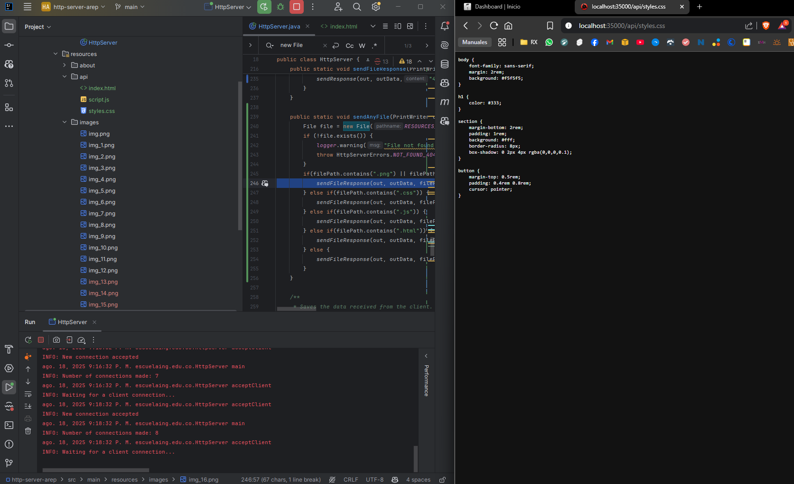

# http-server-arep

Servidor HTTP mínimo en Java — clase principal: `escuelaing.edu.co.HttpServer` (`src/main/java/escuelaing/edu/co/HttpServer.java`). Puerto por defecto: `35000`.

## Requisitos

* JDK 17 instalado; `JAVA_HOME` apuntando al JDK.
* Maven 3.x.
* Ejecutar desde la raíz del proyecto (donde está `pom.xml`).

## Ejecución desde IDE (NetBeans / IntelliJ)

Asegura JDK 17 y Maven configurados en el proyecto.

### NetBeans


### IntelliJ IDEA


Para ejecutar: usa la opción Run/Execute del IDE.

## Ejecución (PowerShell)

```powershell
# Instalar dependencias (desde la raíz del proyecto)
mvn install

# Limpiar y construir el JAR
mvn clean package

# Ejecutar el servidor
java -jar target/http-server-arep-1.0-SNAPSHOT.jar
```

Imágenes de ejemplo (ejecución):


**Detener el servidor:** `GET /stop` o `Ctrl+C`.

## Arquitectura (resumen)

* **Entrada:** `ServerSocket` en puerto `35000`.
* **Routing:** se extrae la ruta con `uri.split("?")[0]` y se hace `switch` por path.
* **Recursos:** archivos en `src/main/resources` (usar `getResourceAsStream` para que funcione empaquetado en JAR).
* **Estado:** `List<String> box` en memoria para `/books` — no persistente.
* **Detener:** ruta `http://localhost:35000/stop` cierra el `ServerSocket`.
* **Limitaciones:** sin pool de hilos, parsing HTTP minimalista, sin validación de entradas; solo maneja una solicitud a la vez.

La arquitectura es simple y directa, enfocada en la funcionalidad básica de un servidor HTTP usando un socket para mantener la comunicación con el cliente y luego cerrarlo al terminar la comunicación.

](src/main/resources/images/img_20.png)

## Pruebas
Para probar el servidor se pueden usar herramientas como Postman o cURL.
Pero en este caso podemos hacerlo desde el navegador web:

### Probando un recurso `html` como [localhost:35000/index.html](`http://localhost:35000/index.html`):


### Probando un recurso rest que retorna un recurso `html` como [localhost:35000/about](`http://localhost:35000/about`)


### Probando un recurso de imagen formato `png` []()`http://localhost:35000/images/img.png`:


### Probando un recurso de tipo `css` como [localhost:35000/api/styles.css](`http://localhost:35000/api/styles.css`):



### Probando un recurso de tipo `JSON` como [`/books?name=Boulevard`](`http://localhost:35000/books?name=Boulevard`) por medio de un recurso REST expuesto:


### Para facilitar el proceso se ofrece un recurso REST con los recursos descritos anteriormente, junto con una ruta para detener el servidor.

